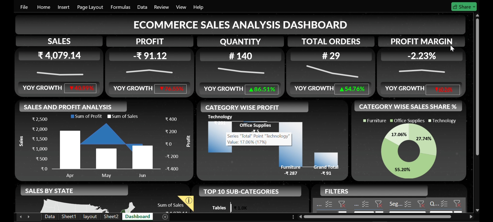

# 📊 E-Commerce Sales Performance Dashboard

## 📌 Project Overview

An interactive E-Commerce Sales Performance Dashboard built using Microsoft Excel to analyze sales, profit, orders, products, categories, and regional performance.

## 📊 Dashboard Preview

## 🛠️ Tools & Technologies

- Microsoft Excel
- Pivot Tables
- Pivot Charts
- Slicers
- Excel Formulas
- Data Visualization
- KPI Analysis

## 🚀 Key Features

- Interactive sales performance dashboard
- KPI analysis for Sales, Profit, Orders, and Quantity
- Category and Sub-Category analysis
- Regional and State-wise sales analysis
- Sales trend analysis
- Interactive filters and slicers
- Dynamic charts and visualizations

## 📈 Key Insights

- Identified top-performing categories and sub-categories
- Analyzed sales and profit across different regions
- Compared business performance over time
- Identified high-performing areas and products

## 📂 Project Files

- `E-Commerce-Sales-Dashboard.xlsx` – Complete Excel dashboard
- `dashboard-preview.png` – Dashboard screenshot

## 🎯 Objective

The objective of this project is to transform raw e-commerce sales data into an interactive and easy-to-understand dashboard that helps users analyze business performance and make data-driven decisions.

## 👨‍💻 Author

**Satyendra Kumar**

B.Tech Computer Science & Engineering
